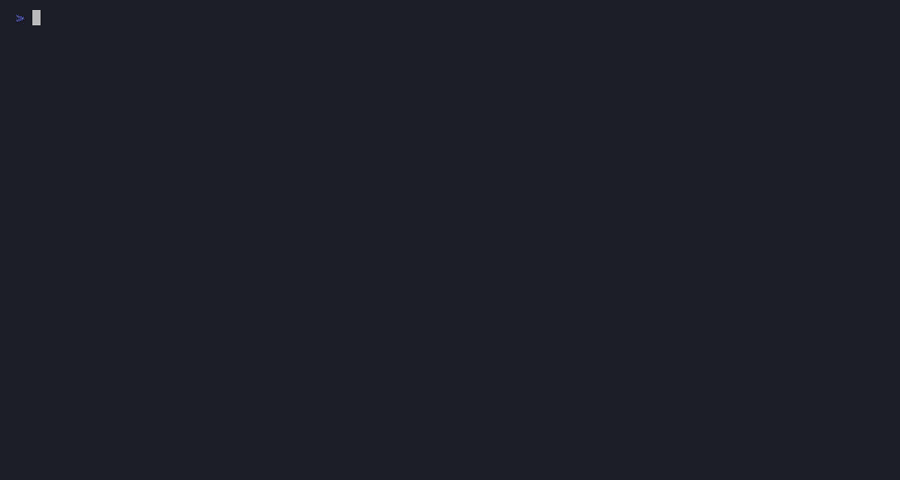

# mcp-image

Say "make these five photos 1200 pixels wide" or "shrink this screenshot and strip the GPS out of it" and it happens, on your machine, in a second. This MCP server does the small image jobs that otherwise send you to a web uploader: resize, convert between PNG, JPEG, BMP, GIF and TIFF, compress with a real before-and-after byte count, crop, thumbnail a folder, watermark with your business name, and drop the EXIF block a phone camera writes into every photo. No upload, no account, no native dependency, no image editor.



**The image chores of a freelance business, done from chat instead of from a browser tab you would rather not hand a client photo to.**

## 60-second install

npm publish for `@theluckystrike/mcp-image` is pending. Until then, the `.mcpb` one-click bundle or a clone+build
is the working path -- both are verified below.

**One-click (.mcpb):** download `image.mcpb` from the latest release and double-click it in Claude Desktop:
https://github.com/theluckystrike/mcp-servers/releases/latest

**Claude Desktop** (`claude_desktop_config.json`):

```json
{
  "mcpServers": {
    "image": {
      "command": "npx",
      "args": ["-y", "@theluckystrike/mcp-image"]
    }
  }
}
```

**Claude Code:**

```sh
claude mcp add image -- npx -y @theluckystrike/mcp-image
```

**Cursor** (`.cursor/mcp.json`):

```json
{
  "mcpServers": {
    "image": {
      "command": "npx",
      "args": ["-y", "@theluckystrike/mcp-image"]
    }
  }
}
```

The `npx` form above starts working the moment the package is published. Until then, use the .mcpb bundle above, or
build from source with exactly these three commands:

```sh
git clone https://github.com/theluckystrike/mcp-servers.git && cd mcp-servers
npm install
npm run build -w packages/mcp-license -w servers/image
```

Then point your client's `command` at `node` with one arg: the absolute path to `servers/image/dist/index.js`.

To run in Pro mode set `MCP_LICENSE_KEY` in the same config block, or call `license_activate` once with your key.

## Tools

| Tool | What it does |
| --- | --- |
| `image_info` | Format, pixel dimensions, megapixels, aspect ratio, file size in bytes, whether the image carries an alpha channel, and the bytes it spends per pixel |
| `image_resize` | A resized copy. `inside` fits within the box and keeps the ratio, `cover` fills the box and crops the overflow, `exact` stretches. Give one of width or height and the other follows |
| `image_convert` | Re-encode as PNG, JPEG, BMP, GIF or TIFF. Transparency going to JPEG is flattened onto white, and the answer says so |
| `image_compress` | Smaller bytes, with the count before and after and the percentage saved. `quality` (default 80) and `max_width` |
| `image_crop` | Cut a rectangle: `x`, `y` from the top-left, `width`, `height`. A rectangle past an edge is refused with the real size, never clamped |
| `image_thumbnails` | One thumbnail per file into `out_dir`, each fitting inside `size` by `size` and keeping its aspect ratio |
| `image_watermark` | Text over the image at a corner and an opacity, white on a translucent plate. With no text, your business name from the shared profile [mcp-invoice](../invoice) and [mcp-docx](../docx) write |
| `image_strip_metadata` | A copy with pixels and nothing else: EXIF, GPS, camera, capture time, XMP and colour profiles are not carried across |
| `image_batch_resize` | Resize a whole list into `out_dir`, each keeping its own aspect ratio, named `<name>-<W>x<H>.<ext>` |
| `image_dominant_colors` | The colours that cover most of an image, as hex codes with the share of pixels each covers |
| `license_status` | Show free or Pro mode |
| `license_activate` | Activate a Pro key (verified offline) |

Resource: `image://recent` returns the last 25 operations, newest first, with the inputs, the files written and when.
Prompt: `prepare_for_web` takes a camera-sized image down to a page-sized JPEG, drops the metadata that came with it, and reports the bytes saved.

## What you can say

| You say | Tool |
| --- | --- |
| "How big is this image, and does it have transparency?" | `image_info` |
| "Make this 1200 pixels wide." | `image_resize` |
| "Turn this PNG into a JPEG." | `image_convert` |
| "This photo is 8 MB, get it under a megabyte." | `image_compress` |
| "Crop the top banner out of this screenshot." | `image_crop` |
| "Make thumbnails of everything in this folder." | `image_thumbnails` |
| "Put my company name in the corner of this photo." | `image_watermark` |
| "Strip the GPS coordinates before I send this." | `image_strip_metadata` |
| "Resize all of these to 1600 wide." | `image_batch_resize` |
| "What colours is this logo built from?" | `image_dominant_colors` |
| "Get this ready for the website." | `prepare_for_web` prompt |

## Worked example

```
You: This photo is too big for the site. Get it to 1600 wide and drop the metadata.

  image_info { path: "~/photos/DSC_0491.jpg" }
  -> 6000x4000, 24 MP, JPEG, 8.4 MB, no alpha

  image_compress {
    path: "~/photos/DSC_0491.jpg",
    max_width: 1600,
    quality: 80,
    out_path: "~/photos/DSC_0491-web.jpg"
  }
  -> 8.4 MB -> 412.6 KB (8809124 -> 422500 bytes, -95.2%)
  -> Method: JPEG quality 80 and a resize to 1600 px wide
  -> ~/photos/DSC_0491-web.jpg, 1600x1067, JPEG
```

The JPEG re-encode also drops the EXIF block the camera wrote, including the GPS coordinates. The original file is
byte-for-byte unchanged.

## Free vs Pro

| | Free | Pro |
| --- | --- | --- |
| `image_info` | Unlimited, at any size | Unlimited |
| `image_resize`, `image_convert`, `image_compress`, `image_crop`, `image_strip_metadata` | Sources up to 4 MP (2000x2000 and a bit) | Any size, up to the 50 MB / 10,000 px input caps |
| `image_thumbnails`, `image_batch_resize` | Up to 5 files per call, sources up to 4 MP | Any number of files, any size |
| `image_watermark` | Your business name from the shared profile | Any text you pass |
| `image_dominant_colors` | - | Yes |

A tier limit is an answer, not an error, and nothing is written when one refuses a call.

Pro is a one-time $19, or $39 for every server in the collection, lifetime.

**Get Pro: https://mcp.zovo.one/buy/image**

## `quality` is a JPEG parameter, and only a JPEG parameter

This is the one thing about image compression that surprises people, so the server says it in its own answer rather
than accepting a number and quietly doing nothing with it. A JPEG throws away detail to get smaller, and `quality`
is the dial for how much. A PNG is lossless: there is no dial. Passing `quality: 40` to a PNG output does not make
a PNG 60% smaller, it makes exactly the same PNG.

So the output format follows the extension of your `out_path`, and that is the lever:

- `out_path: "shot-small.jpg"` -- `quality` applies, and a photo typically drops 80-95%.
- `out_path: "shot-small.png"` -- `quality` is reported as not applicable, and only `max_width` removes bytes.

Palette quantisation was measured as an alternative for PNG and rejected: re-encoding a 300x220 noisy PNG through a
16-colour quantiser produced a **larger** file (115,451 bytes against 39,262), because the encoder here writes RGBA
either way and quantising only destroys the row-to-row similarity that the deflate step was exploiting. A tool that
claims to compress and returns a bigger file is worse than a tool that says which knob exists.

`image_compress` therefore always reports the byte count before and after, the percentage, and the method that did
the work -- and, if the output came out larger, it says so and tells you to keep the original.

## Decompression bombs are refused from the header, before anything decodes

A 4 KB PNG can declare that it is 20,000 by 20,000 pixels. Decoding it allocates 1.6 GB of RGBA and takes the
process down before any size check written after the decode could ever run. So the declared dimensions are read out
of the container header -- PNG IHDR, the JPEG SOF segment, the GIF logical screen descriptor, the BMP info header,
the first TIFF IFD -- and a file over 10,000 px on a side is refused there, with the memory it would have taken
named in the message:

```
Error: /path/bomb.png declares 20000x20000 pixels in its PNG header and was refused before decoding:
this server caps a side at 10000 px. A small file that declares an enormous canvas is a decompression
bomb - decoding it would allocate 1526 MB of RGBA. Nothing was decoded.
```

The decoded size is checked again afterwards, because a header probe can come back empty on an unusual TIFF, and a
guard that only sometimes runs is not a guard.

## Existing files are never overwritten, and inputs are never modified

Every tool writes a new file and leaves its inputs byte-for-byte alone -- there is no in-place mode, on purpose.
An `out_path` that already exists is refused:

```
Error: /path/shot-small.png already exists and nothing was written.
Pass overwrite: true to replace it, or give a different out_path.
```

The path is reserved with an exclusive create, not an existence check, so two processes writing the same `out_path`
at the same time cannot clobber each other: one wins, the other is refused and writes nothing. `image_thumbnails`
and `image_batch_resize` reserve every one of their output paths before writing any of them, so a collision on file
3 does not leave files 1 and 2 behind as a half-done batch -- and the reservations are released, so nothing empty is
left on disk either.

Pass `overwrite: true` when replacing the file is what you want.

`overwrite: true` still does not let an output be an input. Writing a result back over one of its own sources
destroys that source -- the pixels are already decoded in memory and get written over the file they came from, so a
4000 px original becomes the 512 px thumbnail and every later read of that path is quietly wrong. So an `out_path`
that resolves to (or shares an inode with) any input of the same call is refused before any work happens.

## What "strip metadata" actually does

`image_strip_metadata` decodes the image and re-encodes it from the raw pixels. EXIF, GPS coordinates, the camera
and lens, the capture time, XMP packets and embedded colour profiles are not removed one by one -- they are simply
never handed to the encoder, so they cannot come out the other side. Two consequences worth knowing:

- The pixels are the same, the bytes are not. A JPEG goes through the encoder a second time, so the copy is not
  bit-identical to the original even though it looks the same. Keep the original if that matters.
- Every other writing tool here has the same effect as a side effect. Resizing a photo also drops its EXIF.

## Limits

- Inputs over 50 MB are refused: an image decodes to width x height x 4 bytes of raw RGBA regardless of how well it
  is compressed on disk.
- 10,000 px per side, checked from the header first and from the decode second.
- Read and written: PNG, JPEG, BMP, GIF and TIFF, detected by magic bytes rather than by file extension. No WebP,
  no AVIF, no HEIC, no SVG -- there is no pure-JavaScript decoder for those that is worth shipping, and this server
  takes no native dependency.
- An animated GIF is read as its first frame. This server does not do animation.
- Watermark text is drawn with the bundled Open Sans bitmap faces (8, 16, 32, 64 and 128 px), and the largest one
  that fits the image is chosen. A character those faces do not carry is not drawn, so there is no CJK watermark.
- No rotation, no filters, no colour correction, no OCR, no background removal. This server does the size-and-format
  jobs; it is not an image editor.

## How it stores data

Only a register of what it did: `${XDG_DATA_HOME:-~/.local/share}/mcp-servers/image/operations.json`, the last 500
operations, as plain JSON. Your images stay where you put them. Every write to the register runs inside an advisory
lock on `.../image/.lock`, so two clients on one data directory cannot lose a record, and saves go to a temporary
file and are renamed into place.

If the register is unreadable or not valid JSON it is never treated as "empty": it is moved aside byte-for-byte as
`operations.json.corrupt-<timestamp>` with a marker beside it. The image you asked for is still written -- the file
is on disk before the register is touched -- and the answer tells you the history could not be updated.

The watermark reads the one shared profile the whole suite uses,
`${XDG_DATA_HOME:-~/.local/share}/mcp-servers/profile/business.json`, written by `business_set` in mcp-invoice or
mcp-docx. Nothing is invented: with no name stored and no text passed, `image_watermark` refuses and says which tool
to run.

## Privacy

All data stays local. The server reads and writes files on your machine and makes no network request of any kind --
not for licensing (keys are verified offline), not for fonts, not for telemetry. A client photo you resize is never
uploaded anywhere, which is the entire reason this exists.

## Pairs with

- [mcp-docx](../docx/README.md) -- size a logo here, then put it in the letterhead: `image_resize` to the header
  height, then the `.docx` writer picks the file up from disk.
- [mcp-pdf](../pdf/README.md) -- shrink the scans before you merge them, so the joined PDF is not 40 MB.
- [mcp-resume](../resume/README.md) -- one correctly sized, metadata-free headshot for the CV and the application form.
- [office-suite](../office-suite/README.md) -- several servers behind one install, one config entry.

## Troubleshooting

- **`npx` hangs or fails to find the package**: npm publish for this package is pending. Use the `.mcpb` bundle or
  the clone-and-build path above until it lands.
- **"quality does not apply to a PNG output"**: write to a `.jpg` `out_path`, or pass `max_width`. See the section
  above.
- **"declares NxN pixels ... and was refused before decoding"**: the file claims a canvas over 10,000 px per side.
  If it is genuinely that large, resize it with a tool that streams tiles; this server decodes whole images.
- **"does not start with the magic bytes"**: the file is not a PNG, JPEG, BMP, GIF or TIFF. A `.png` name on a WebP
  file is the usual cause; convert it first.
- **"already exists and nothing was written"**: pass `overwrite: true`, or a different `out_path`.
- **The watermark is tiny**: the largest bundled face is 128 px, and it is chosen to fit within 80% of the image
  width. On a very large photo, resize first and watermark second.
- **Node version**: requires Node >= 18. Check with `node -v`.

MIT licensed. Support: support@zovo.one

Built by [theluckystrike](https://github.com/theluckystrike).
